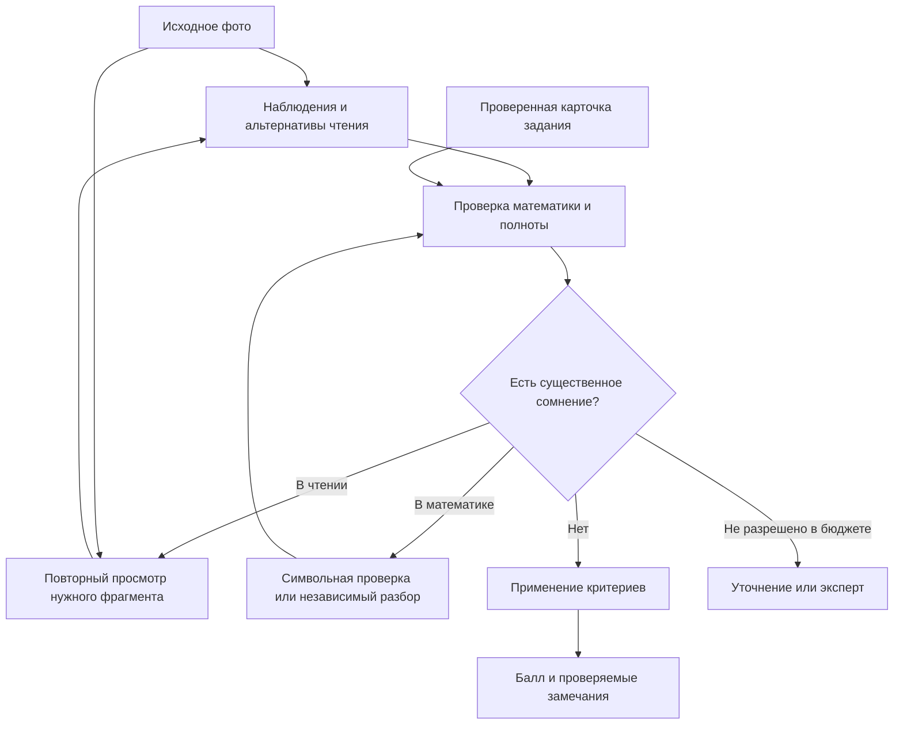

# BotAI: где искать эврику в проверке рукописной математики

Исследование на 19 сентября 2026 года. Три исследовательских агента работали параллельно: OCR и зрение; стартапы и американские выступления; математическая проверка и архитектура. Затем выполнены дополнительные проходы по контраргументам, технологиям ввода и видеоматериалам. Основной агент изучил текущий код, официальные материалы ФИПИ и смежные исследования автоматического оценивания.

Это исследовательская карта, не заявление о достигнутой точности. Модели проекта и платные OCR API не вызывались. Код приложения и настройки не менялись. Числа из чужих бенчмарков нельзя переносить на ЕГЭ. Видео изучались по доступным расшифровкам, описаниям и авторским материалам; полный аудиовизуальный просмотр не заявляется.

## 1. Главная ставка

**Агент должен уметь устанавливать, какой фрагмент работы ещё нужно увидеть или проверить, чтобы его заключение стало обоснованным.**

Пример: в ответе плохо различима скобка у критической точки. Обычный OCR выбирает одну запись, после чего проверяющий уверенно оценивает уже эту версию. Предлагаемая система сохраняет две гипотезы, выясняет последствия и запрашивает только нужный фрагмент фотографии. При этом математическая правдоподобность не даёт права выбрать более выгодное ученику прочтение.

Вторая часть ставки: **каждая существенная претензия получает проверяемое основание**. Для неравенства это может быть конкретное потерянное значение переменной, недопустимая точка, невыполненное условие преобразования. Для оформления — применимый критерий и видимая недостающая часть обоснования. «Так кажется модели» недостаточно.

Вместе получается продуктовая идея: проверяющий, который показывает, где именно возникла проблема, чем она подтверждена и какое единственное уточнение ещё требуется. Это пока гипотеза для BotAI, а не опубликованный готовый метод проверки ЕГЭ.

## 2. Сильнейшие результаты расследования

### 2.1. Хороший математик может быть плохим OCR

В работе [When VLMs ‘Fix’ Students](https://arxiv.org/html/2604.22774v2) изучено нежелательное исправление ошибок при транскрипции рукописной математики. Для проверки это уничтожение наблюдаемого материала: ребёнок ошибся, а распознаватель восстановил правильное выражение. Поэтому обычное качество OCR и пригодность для оценивания — разные цели.

Проектный вывод: измерять отдельно сохранность критических ошибок ученика. Правдоподобный LaTeX не должен побеждать верное чтение неправильной записи. В ваших промптах запрет на исправления уже есть, но также существует разрешённая нормализация артефактов. Её пользу и вред нужно проверять на контрастных парах, а не оценивать по красоте результата.

### 2.2. Правильный балл может скрывать неправильное чтение

[EDU-CIRCUIT-HW](https://arxiv.org/html/2602.00095v3) рассматривает 1334 настоящие работы по электрическим цепям. Авторы отдельно оценивают чтение и оценивание: совпавший балл иногда маскирует ошибки распознавания. В одном варианте их корректирующей процедуры человеку передавалось 3,3% работ; это показатель конкретного case study, а не обещание для BotAI. Содержательный перенос — проверять основания негативного результата и измерять чтение независимо от балла.

### 2.3. У вас уже есть две и три стадии

В [pipeline.py](../../../../app/legacy_grading/pipeline.py) `reconstruct_first` выбирает OCR→текстовый анализ либо прямой анализ фотографии. Это уже исследовательская развилка. Но одновременно меняются доступ к изображению и используемый клиент. Без дополнительных вариантов победу нельзя приписать именно объединению стадий.

В раздельном режиме анализатор не может заново рассмотреть фотографию. В структуре [SolutionLine](../../../../app/domain/stages.py) есть текст и самооценка уверенности, но нет координат и списка альтернативных чтений. Сейчас передача информации необратима.

### 2.4. Найдена предметная проблема в критерии №15

На странице 83 официального [сборника ФИПИ-2026 для предметных комиссий](https://doc.fipi.ru/ege/dlya-predmetnyh-komissiy-subektov-rf/2026/matematika_mr_ege_2026.pdf) различаются ошибка строгости границы и включение значения вне области определения исходного неравенства. Во втором случае указано оценивание в 0 баллов. Страница прочитана и проверена визуально.

Ваш [шаблон критерия](../../../../prompts/legacy/criteria/15.md) говорит об отдельных точках без этого ограничения и отмечен `verified: false`. Поэтому наивная проверка «множества различаются одной точкой → 1 балл» будет неверна. Первая предметная фишка — хранить происхождение каждой границы: ноль числителя, полюс, граница логарифма, диапазон замены.

Пример для `(x−1)/(x+2) ≥ 0`: правильное множество `(-∞,-2) ∪ [1,+∞)`. При прочих верных шагах исключение точки 1 относится к ошибке строгости. Включение −2 вводит значение, при котором исходная дробь не определена. Внешне обе ошибки выглядят как одна скобка, но экзаменационный смысл разный.

### 2.5. Промпты могут создавать ошибки, похожие на слабость модели

В [stage3_grading.md](../../../../prompts/legacy/stage3_grading.md) последнему этапу предлагается заново разделить находки на содержание и оформление. Это расходится с инвариантом AGENTS.md: такое решение должно приниматься на стадии 2 через `is_defensible`. Там же есть установка снижать оценку при сомнениях и отдельные указания про невыписанную ОДЗ, хотя ниже присутствует ограничение применимыми критериями. Это внутреннее напряжение инструкций, а не доказанный результат конкретного запуска.

ФИПИ на той же странице 83 допускает разные способы и формы решения и использование школьных фактов без доказательства и ссылок. Следовательно, отсутствие отдельного заголовка ОДЗ нельзя механически приравнивать к отсутствию учёта ограничений. Изображение, математические основания и критерий должны рассматриваться вместе.

## 3. Сколько стадий делать

Рабочая архитектурная гипотеза: **три логические ответственности, адаптивное число вызовов**.

| Ответственность | Что установить | Что сохранить |
|---|---|---|
| Наблюдение | Что действительно написано | Исходный фрагмент, буквальное чтение, альтернативы, зачёркивания, пространственные связи |
| Проверка | Какие переходы верны, что подтверждено или отсутствует | Область действия условий, свидетельства ошибок, связи между находками |
| Оценивание | Как доказанные обстоятельства соотносятся с критерием | Версия критерия, основание балла, неразрешённые сомнения |

Это не обязательно три разных модели или три вызова. Совместный зрительный вызов может читать и предлагать кандидатов на ошибки; подтверждение кандидата остаётся отдельной логической обязанностью. Проверка рационального перехода может выполняться обычным кодом. Дополнительный читатель нужен только спорным участкам.

Циклы должны иметь ограничение числа повторов и состояния «не установлено». Несколько одинаковых уверенных ответов не заменяют доказательств. Ошибка распознавания, математическое сомнение и неоднозначность рубрики требуют разных действий.

Для сравнения нужны A: фото→анализ→балл; B: OCR→текст→анализ→балл; C: OCR+исходное фото→анализ→балл; D: C с адресным повторным чтением. Отдельно: экспертная транскрипция→анализ. Последний вариант показывает, сколько ошибок остаётся при устранённом OCR.

## 4. Восемь направлений для эврики

### 1. Устойчивость заключения при разных прочтениях

Хранить небольшое число действительно допустимых чтений спорного места. Если меняется балл, существенная находка или рекомендация — уточнять. Если меняется только неважная типографика — можно продолжить. Совпадения одного балла недостаточно: два разных неверных обвинения тоже могут дать 0.

Ограничение: не перебирать все сочетания символов. Сначала работать с одной локальной неоднозначностью; при множестве нечитаемых участков запросить новый снимок. Иначе экспоненциальное ветвление съест вычисления.

### 2. Контрпример вместо общего обвинения

Ученик заменяет `(x−1)/(x+2)>0` на `x−1>0`. При отсутствии дополнительных ограничений `x=−3` опровергает равносильность. Агент может показать потерянную ветвь, а не сказать «неверно домножил».

[SymPy](https://docs.sympy.org/latest/guides/solving/reduce-inequalities-algebraically.html) и [Z3](https://microsoft.github.io/z3guide/programming/Z3%20Python/Introduction/) подходят для ограниченных классов выражений. Логарифмы и экспоненты требуют обоснованных преобразований; формализация моделью тоже может быть неверной. Отсутствие найденного контрпримера не доказывает корректность, а неподдерживаемое выражение не является ошибкой ученика.

### 3. Типизированная числовая ось

Для №15 ось — важная часть решения. Сохранить точки, их происхождение, закрашенность, знаки интервалов, исключённые значения и связь с итоговым ответом. Это исследовательская идея специализированного представления, не предложение обучать отдельную нейросеть заранее.

Так можно отдельно проверять: верно ли найдены критические точки; правильно ли расставлены знаки; включены ли допустимые границы; не включён ли полюс. Такая структура намного ближе к ошибкам №15, чем общий текст «ученик использовал метод интервалов».

### 4. Апелляция до показа оценки

Независимый проверяющий получает исходный фрагмент, конкретное предполагаемое нарушение и необходимые условия, но не уверенную речь первого агента. Он ищет основание отменить ложное обвинение: другая ветвь на полях, учтённое ограничение, ошибочно прочитанный знак. Ему запрещено дописывать ученику отсутствующий шаг.

У [Cognition](https://cognition.com/blog/multi-agents-working) есть инженерное наблюдение о пользе рецензента с чистым контекстом в программировании. Перенос на оценивание — наша гипотеза. Проверять надо две стороны: сколько ложных снижений отменено и сколько настоящих ошибок ошибочно оправдано. Периодическая проверка работ с максимальным баллом нужна, чтобы не потерять чувствительность к пропущенным ошибкам.

### 5. Проверенная карточка задачи вместо повторного решения на каждый снимок

Заранее хранить точное условие, область определения, множество решений, критические точки и основания, допустимые методы, критерии и примеры границ между 0/1/2. Независимый решатель при подготовке карточки не видит работу ученика. Эксперт подтверждает карточку один раз, после чего она используется для многих работ.

Не заставлять ученика идти по эталонному пути: карточка задаёт математические факты и правила оценивания, а не единственную последовательность строк. Для незнакомого задания неподтверждённый модельный эталон остаётся гипотезой.

### 6. Персональный словарь почерка и активная камера

Спорную цифру можно сравнить с несколькими подтверждёнными образцами того же автора на этой странице. При повторном фото интерфейс выделяет нужную строку. В будущем короткая серия снимков может дать кадр без смаза. Это продуктовые гипотезы: выигрыш сравнивается с дополнительным действием пользователя.

Нельзя генерировать недостающие штрихи и считать их свидетельством. Усиление контраста тоже иногда уничтожает тонкую черту; оригинал сохраняется. Цифровое перо даёт реальные траектории, но меняет привычный сценарий работы и не подходит всем школьникам.

### 7. Фабрика проверяемых мутаций

Из одной размеченной работы получать семейство: та же работа при ином освещении; ОДЗ на полях; эквивалентный ответ; потерянная граничная точка; добавленный полюс; одна неверная смена знака. Для первых вариантов заключение сохраняется, для последних изменение заранее определяет эксперт.

Так можно проверять, различает ли система визуальные изменения и изменения математики. Реальные неправильные рукописи необходимы: идеально напечатанные синтетические ошибки не заменяют их. Семейства одной работы не должны попадать одновременно в настройку и итоговый тест.

### 8. Маленький экран эксперта как источник уникальных данных

Эксперт видит фото и карточку претензии; подтверждает, отменяет или меняет причину. Сохраняется тип провала: OCR, математическая интерпретация, пропущенный контекст, неверное применение критерия. Это создаёт данные о слабостях именно вашего агента.

[Gradescope](https://guides.gradescope.com/hc/en-us/articles/24838908062093-AI-assisted-grading-and-answer-groups) использует группировку ответов и работу преподавателя с рубрикой. Его автоматическая группировка имеет ограничения по типу задания и не означает автоматическую проверку произвольного доказательства. Переносимая идея — снижать стоимость экспертного внимания. Для BotAI можно группировать похожие спорные переходы для разметки, сохраняя индивидуальную проверку каждой работы.

## 5. Что известно про PhotoRus и Nanimai

На [сайте PhotoRus](https://photorusapp.ru/) сейчас предлагается вставить текст, а загрузка и распознавание фотографий отмечены как временно недоступные. Причины не раскрыты. Это не свидетельство плохого продукта, но и не доказательство решённой проблемы OCR. Публичной информации недостаточно для выводов о моделях, стадиях или точности.

[Nanimai](https://nanimai.tech/) описывает сбор и ранжирование кандидатов, уточнение недостающей информации, историю диалога и интеграцию с ATS. Это заявления компании о продуктовых возможностях. Архитектура и независимые оценки качества на просмотренной странице не раскрываются.

Полезный перенос в BotAI: агент может сам закрывать конкретный пробел входных данных и доставлять проверяемый результат в рабочий процесс. Для друзей полезнее вопросы о последних ошибках и ручных исправлениях, чем о количестве агентов:

- Какие двадцать последних случаев вас заставили изменить систему?
- Какие ответы всё ещё исправляет человек?
- Что вы показываете пользователю, когда модель не справилась?
- Как доказываете, что новый промпт не ухудшил старые случаи?
- Что случилось с фото-вводом PhotoRus и что нужно для его возвращения?

Контактов с основателями в рамках исследования не было.

## 6. Американские видео, которые дали конкретные идеи

| Материал | Полезный фрагмент | Перенос в BotAI |
|---|---|---|
| [YC: интервью с Jake Heller, Casetext](https://www.youtube.com/watch?v=eBVi_sLaYsc) | 21:10 — проектирование от результата специалиста; 25:46 — сложные входные документы и OCR; 31:59 — почти незаметные изменения смысла | Проектировать артефакт хорошего проверяющего; тестировать один изменённый знак в почти одинаковой работе |
| [AI Engineer: Hamel Husain и Emil Sedgh, Rechat](https://ai.engineer/talks/eLXF0VojuSs-construct-domain-specific-llm-evaluation-systems) | 6:33 — удобство просмотра и разметки; 15:15 — поведение, которого добивались дообучением | Собственный маленький экран эксперта; учить уточнять недостающие данные только после выявления устойчивого провала |
| [AI Engineer: Alex Volkov, Judging LLMs](https://ai.engineer/talks/IIL2tE4n1Q0-judging-llms) | 14:47 — оценка реального визуального результата | Проверять фото с нанесёнными замечаниями, а не только число в JSON |
| [YC: Vertical AI Agents Could Be 10X Bigger Than SaaS](https://www.youtube.com/watch?v=ASABxNenD_U) | 9:09 и 40:04 — отраслевые нюансы и выбор вертикали | Знание пограничных решений №15 как предметное преимущество |
| [Anthropic: Building more effective AI agents](https://www.youtube.com/watch?v=uhJJgc-0iTQ) | По опубликованным главам: 8:30 — простые архитектуры; 12:25 — параллелизация; 15:00 — контекст и инструменты | Рой для исследований и ограниченные роли в проверке — разные архитектурные решения |

Первые четыре материала изучались по доступному тексту выступлений или его фрагментам; для последнего получены описание и главы, поэтому содержательные технические выводы опираются на отдельную [инженерную статью Anthropic](https://www.anthropic.com/engineering/building-effective-agents). Подробности доступа и дополнительные ссылки приведены в записке о стартапах. Историческое число промптов в Casetext не является рецептом для ЕГЭ.

## 7. Технологическая карта

| Кандидат | Разумная роль | Чего не обещает |
|---|---|---|
| [Mathpix](https://docs.mathpix.com/reference/post-v3-text) | Независимый специализированный читатель формул и кропов | Готовая точность выставления балла за №15 |
| [PaddleOCR Formula Recognition](https://github.com/PaddlePaddle/PaddleOCR/blob/main/docs/version3.x/pipeline_usage/formula_recognition.en.md) | Локальный кандидат для выделенных формул | Чтение всей логики тетрадного листа без проверки |
| [Uni-MuMER](https://github.com/BFlameSwift/Uni-MuMER) | Исследовательская специализация под рукописные выражения | Универсальный экзаменатор |
| [SymPy](https://docs.sympy.org/latest/guides/solving/reduce-inequalities-algebraically.html) | Множества решений поддерживаемых выражений | Полное решение всех логарифмических и показательных задач |
| [Z3](https://microsoft.github.io/z3guide/programming/Z3%20Python/Introduction/) | Проверка ограничений и контрпримеров в поддерживаемой теории | Проверка правильности OCR или всего русского доказательства |
| [Math-Verify](https://github.com/huggingface/Math-Verify) | Извлечение и сравнение математических ответов | Проверка обоснованности ученических шагов |
| [MathWriting](https://github.com/google-research/google-research/blob/master/mathwriting/archive_readme.md) | Данные о рукописных выражениях и цифровых штрихах | Репрезентативный тест фото ЕГЭ |
| [FERMAT](https://arxiv.org/abs/2501.07244), [ScratchMath](https://github.com/ai-for-edu/ScratchMath) | Образцы задач обнаружения и локализации ученических ошибок | Автоматический перенос рейтинга моделей на ваши критерии |
| [Conformal Risk Control](https://arxiv.org/abs/2208.02814) | Поздний этап: калибровка среднего риска при статистических предпосылках | Индивидуальная гарантия правильности каждого балла |

Не найдено доказательств, что замена текущей оркестрации фреймворком сама по себе улучшит проверку. Полная формализация в Lean, обучение собственного OCR и PRM — отдельные исследовательские ставки. Их стоит рассматривать после обнаружения конкретного ограничителя, который нельзя дешевле устранить.

## 8. Как получить собственную эврику из экспериментов

### Сначала определить, что именно ломается

На 30–50 проблемных работах вручную сравнить: оригинальная фотография; точная транскрипция с сохранёнными ошибками; выводы модели; решение эксперта. Если идеальная транскрипция почти не помогает, основная проблема сейчас в математике или рубрике. Если помогает сильно — OCR становится первым объектом работы. Это диагностический опыт, а не измерение готовности к массовому использованию.

### Пять исследований с различающимися ответами

| Опыт | Что проверяем | Какой результат меняет решение |
|---|---|---|
| A/B/C/D архитектуры на одинаковых работах | Польза совместного зрения и возврата к изображению | C лучше B: важен доступ к фото; D лучше C: полезен адресный повтор |
| Контрастные пары с одной реальной ошибкой | Сохранность ошибки при OCR | Хороший CER при плохой сохранности: сменить цель выбора OCR |
| Ручная формализация 30–50 переходов | Польза символьного свидетеля без OCR | Мало поддерживаемых полезных случаев: не усложнять интеграцию |
| Отдельная проверка предполагаемых штрафов | Снижение ложных обвинений | Успех только если не растут пропущенные настоящие ошибки |
| Несколько прочтений одной строки | Польза уточнения по влиянию на заключение | Мало существенных сомнений: локальные кропы дешевле полного повторения |

Для архитектурного сравнения разумна разведочная выборка 100–150 реальных работ разных авторов и типов неравенств. Это ориентир для эксперимента, не статистическое обоснование 99% качества. Два эксперта разрешают расхождения; итоговый тест отделяется по ученикам и семействам задач. Сначала сравнить при одинаковой модели и возможностях, затем при одинаковой стоимости. Иначе число стадий смешивается с качеством провайдера.

### Метрики, которые трудно обмануть

- Точное совпадение балла 0/1/2 с согласованной экспертной оценкой.
- Доля ложных снижений и доля необоснованных максимальных оценок по отдельности.
- Истинность замечания и точность привязки к строке, даже если балл совпал.
- Сохранность исходных математических ошибок после OCR.
- Доля автоматических решений и ошибка среди них, чтобы отказ от сложных работ не создавал ложную высокую точность.
- Устойчивость к повторному снимку, альтернативному корректному решению и смене расположения записей.
- Цена и задержка на работу, включая уточнения и повторные вызовы.

Метрика «в пределах одного балла» слаба для шкалы 0–2: она легко скрывает почти все ошибки. Самооценка `confidence=0.97` не является измеренной вероятностью. Нужна калибровка на независимых данных, а для редких серьёзных провалов — существенно больше наблюдений.

## 9. Где наши идеи могут оказаться неверными

**Контрпример вне контекста.** Ученик мог записать дополнительное условие на полях или временно получить кандидатов и затем их проверить. Проверка двух соседних строк как безусловно равносильных создаст ложное обвинение. Нужны активные условия, направление перехода и просмотр всей ветви решения.

**Ложное согласие OCR.** Две версии могли обе пропустить фрагмент; истинного чтения может не быть среди предложенных. Согласие не является вероятностной гарантией. Уточнение ученика о том, что он имел в виду, нельзя незаметно превратить в присутствовавшее на исходном фото доказательство.

**Двойное наказание.** Одна вычислительная ошибка способна породить неверные корни, интервалы и ответ. Это несколько наблюдений об одной причине. Балл определяется критерием работы целиком, а не количеством карточек. Нужно отличать последствия одной ошибки от независимых нарушений.

**Защитник становится слишком добрым.** Агент, отменяющий ложные претензии, может начать оправдывать настоящие ошибки. Поэтому его измеряют и на ложных снижениях, и на ошибочных оправданиях. Максимальные оценки тоже выборочно аудируются.

**Чрезмерная специализация.** Символьный инструмент может поддерживать лишь небольшую часть реальных переходов, а персональный словарь почерка — требовать больше действий, чем пользователи готовы сделать. Эти идеи имеют смысл только после узкого сравнительного опыта.

## 10. Вывод для следующего исследования

Самая перспективная ставка — **обратимая проверка с сохранёнными свидетельствами и адресным разрешением сомнений**. Сохранить раздельность наблюдения, математического вывода и применения критерия; проверить возможность совместного первичного чтения; дать анализатору возвращаться к нужному участку; для №15 добавить происхождение границ и поиск контрпримеров.

Самая быстрая содержательная проверка этой ставки: набор из правильной работы, той же работы с потерянной допустимой границей и той же работы с включённым полюсом. Повторить для нескольких почерков и фотографий. Если агент различает эти случаи, сохраняет ошибку при чтении и показывает её зрительное и математическое основание, вы получили гораздо более ценный прогресс, чем ещё одного участника обсуждения.

Подробные исследовательские записки:

- [OCR, способы ввода и сохранность ошибок](ocr-and-vision.md).
- [Стартапы, американские видео и инженерные практики](startups-and-talks.md).
- [Математическая проверка, архитектура и контраргументы](verification-and-red-team.md).
